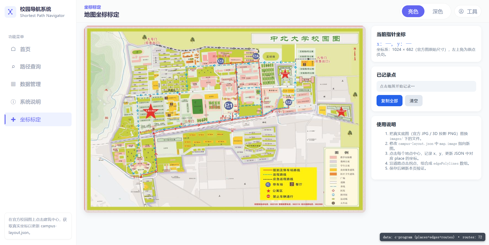
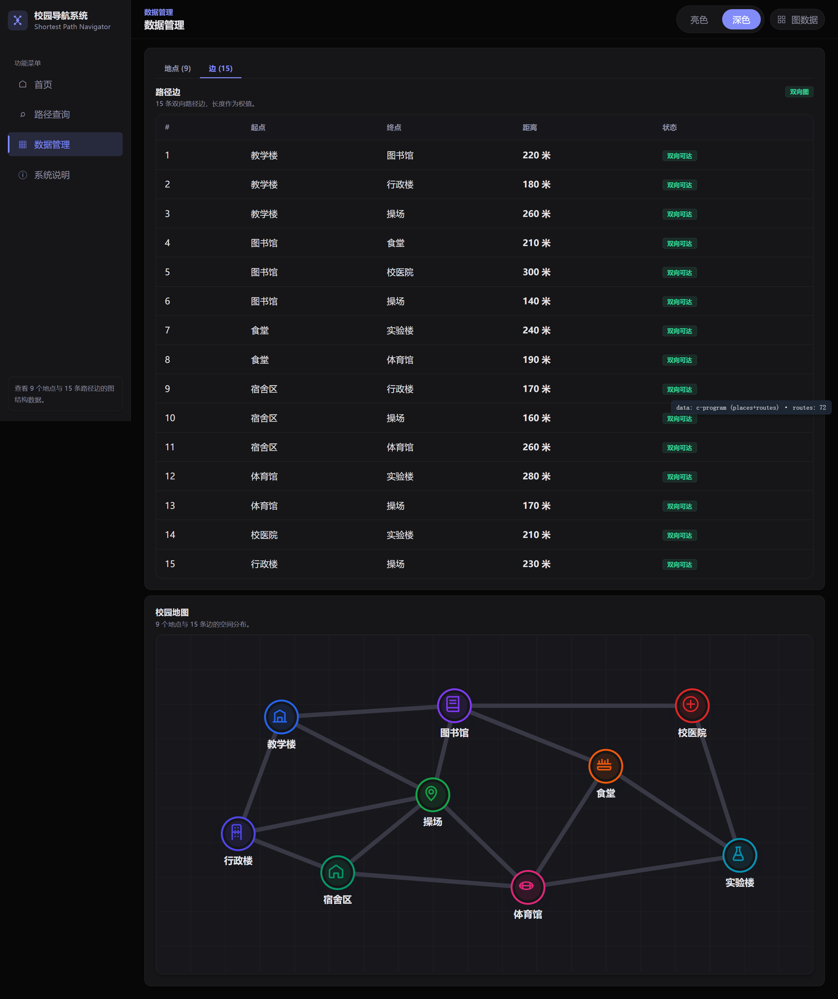

<p align="center">
  <h1 align="center">校园最短路径导航系统</h1>
  <p align="center"><em>Graph-powered campus navigation for NUC</em></p>
  <p align="center">中北大学软件学院《数据结构》课程设计项目。用 C99 实现 Dijkstra 核心算法，静态前端读取 C 导出的 JSON，在官方校园平面图上可视化最短路径与距离。</p>
</p>

<p align="center">
  
</p>

<p align="center">
  <a href="https://github.com/Aafff623/campus-shortest-path-navigation-system"></a>
  
  
  
</p>

<p align="center">
  <a href="#为什么做这个项目">为什么</a> ·
  <a href="#功能">功能</a> ·
  <a href="#演示">演示</a> ·
  <a href="#快速开始">快速开始</a> ·
  <a href="#架构">架构</a> ·
  <a href="#路线图">路线图</a> ·
  <a href="#文档">文档</a>
</p>

---

## 为什么做这个项目

校园面积大、楼栋多，师生日常需要快速知道「从 A 到 B 怎么走最近」。本项目把这个问题抽象为**无向带权图的最短路径问题**：

- 用**图结构**存储地点与路径长度。
- 用 **Dijkstra 算法**求解任意两点间的最短路径。
- 用**官方校园平面图**作为底图，把算法结果高亮展示。

```text
地点与路径数据 → C 后端 Dijkstra → routes.json → 静态前端 → 地图高亮 + 文字路线
```

---

## 功能

| 功能 | 说明 |
|---|---|
| **地点管理** | 教学楼、图书馆、食堂、宿舍、体育馆、实验楼、校医院、行政楼、操场，共 9 个校园地点 |
| **路径维护** | 15 条双向带权边，权值为路径长度 |
| **最短路径查询** | 基于 Dijkstra 算法，输出最短路线与总距离 |
| **地图可视化** | 官方校园平面图 overlay，高亮道路、地点与查询结果 |
| **异常处理** | 不存在的节点、起终点相同、未选择起终点等 |
| **主题切换** | 亮色 / 深色主题 |
| **坐标标定工具** | 内嵌 `calibrate.html`，可继续精调坐标与道路 polyline |

---

## 演示

### 前端界面一览

| | | |
|:---:|:---:|:---:|
| [](docs/reports/screenshots/index-after-calibration.png)<br><br>**首页**<br>系统概览与常用地点入口 | [](docs/reports/screenshots/query-result-after-calibration.png)<br><br>**路径查询**<br>Dijkstra 结果与地图高亮 | [](docs/reports/screenshots/calibrate-page-nav-embedded.png)<br><br>**坐标标定**<br>官方图坐标调试工具 |
| [](docs/reports/screenshots/after-data-edges-light.png)<br><br>**数据管理**<br>地点与边的维护 | [](docs/reports/screenshots/after-docs-algorithm-light.png)<br><br>**系统说明**<br>算法与使用说明 | |

---

## 快速开始

### 1. 编译并导出数据

```bash
git clone https://github.com/Aafff623/campus-shortest-path-navigation-system.git
cd campus-shortest-path-navigation-system
make
bin/campus_nav.exe --export
```

导出结果写入 `assets/data/routes.json`。

### 2. 启动前端预览

```bash
cd assets/prototype/campus-nav-prototype
python -m http.server 8081
```

浏览器打开：

- 首页：`http://localhost:8081/index.html`
- 路径查询：`http://localhost:8081/query.html`
- 数据管理：`http://localhost:8081/data.html`
- 系统说明：`http://localhost:8081/docs.html`
- 坐标标定：`http://localhost:8081/calibrate.html`

> 端口 8080 常被其他服务占用，当前统一使用 **8081**。

### 3. 验证路线查询

在「路径查询」页选择起点和终点，点击查询，即可看到文字路线、总距离与地图高亮。

---

## 架构

```text
C 后端 (Dijkstra)
  → routes.json
    → 静态前端 (HTML/CSS/JS)
      → 官方校园平面图 overlay (SVG + campus-layout.json)
```

| 层 | 技术 | 说明 |
|---|---|---|
| 算法后端 | C99 · gcc / MinGW · Makefile | Dijkstra 最短路径、JSON 导出 |
| 数据交换 | JSON | `assets/data/routes.json` |
| 前端 | HTML · CSS · JavaScript（Vanilla） | 5 页面：首页、查询、数据、说明、坐标标定 |
| 地图 overlay | SVG · 官方校园平面图 | `campus-layout.json` 驱动 marker / polyline |

### 2D 校园图 overlay

- 底图：`assets/prototype/campus-nav-prototype/images/nuc-campus-map-official.jpg`
- 坐标配置：`assets/prototype/campus-nav-prototype/data/campus-layout.json`
- 状态：`official-map-manual-calibrated-v1`（第一轮人工标定）
- 坐标标定工具：`assets/prototype/campus-nav-prototype/tools/coordinate-debug-tool.html`（内置近似比例尺 **1:20000**，图上 1cm ≈ 200m，支持两点距离估算）

> 官方图分辨率有限，部分建筑名称无法 100% 确认；当前坐标按功能区与可见建筑做了最佳估计，可在 `calibrate.html` 中继续精调。比例尺根据图中田径场一圈约 800m 估算，仅用于课程设计 Demo，不作为 GIS 精确测量依据。

---

## 路线图

| 阶段 | 状态 | 说明 |
|---|---|---|
| 前端 5 页面与主题统一 | ✅ 完成 | 首页 / 查询 / 数据 / 说明 / 坐标标定 |
| 去 AI 化视觉收紧 | ✅ 完成 | 见 `docs/prd/PRD-Frontend-Visual-Polish.md` |
| 真实 2D 校园图 overlay | ✅ 完成 | 官方平面图 + 第一轮坐标标定 |
| 首页卡片撑满视口 | ✅ 完成 | layout fix |
| 地点 / 路径增删改真实数据 | 🔜 待实现 | 当前为演示提示，未持久化 |
| 算法复杂度分析与性能测试 | 🔜 待补充 | 放入课程设计说明书 |
| `data.html` / `docs.html` 垂直空间优化 | 🔜 可选 | 减少滚动 |

---

## 文档

| 文档 | 说明 |
|---|---|
| [`docs/prd/PRD-校园最短路径导航系统.md`](docs/prd/PRD-校园最短路径导航系统.md) | 产品需求文档（master） |
| [`docs/prd/PRD-Frontend-Visual-Polish.md`](docs/prd/PRD-Frontend-Visual-Polish.md) | 前端视觉升级 PRD（历史） |
| [`docs/handoff/运行说明.md`](docs/handoff/运行说明.md) | 运行说明与端口配置 |
| [`docs/handoff/backend-integration.md`](docs/handoff/backend-integration.md) | 后端与数据集成（导出 + 2D 地图叠加） |
| [`docs/handoff/frontend-polish-log.md`](docs/handoff/frontend-polish-log.md) | 前端改造记录（调研→实施→验收） |
| [`CLAUDE.md`](CLAUDE.md) | 项目规范与开发约定 |
| [`CONTEXT.md`](CONTEXT.md) | 领域上下文与架构决策 |

---

Made with ❤️ for 中北大学软件学院《数据结构》课程设计
